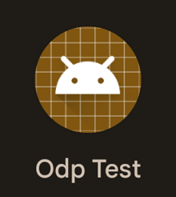
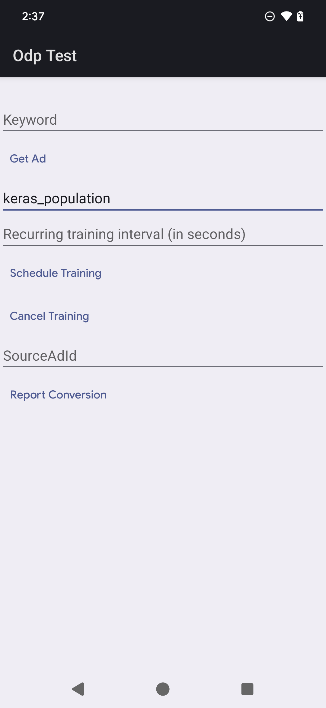

## On-Device Personalization Federated Learning E2E Device & Server (No Encryption)

Tutorial of [Create federated learning job](https://developers.google.com/privacy-sandbox/protections/on-device-personalization/create-federated-learning-job) using a sample model and configuration. Encryption for payloads leaving the device and in Trusted Execution Environments (TEE) is disabled through debug flags for this tutorial.


### On-Device Personalization Federated Compute Server

This tutorial requires an [On-Device Personalization Federated Compute Server](https://github.com/privacysandbox/odp-federatedcompute) deployed.

#### Prerequisite

1. Deploy the server on Google Cloud Platform (GCP): https://github.com/privacysandbox/odp-federatedcompute/blob/main/BUILDING.md
    - For [Coordinator Configuration](https://github.com/privacysandbox/odp-federatedcompute/blob/main/shuffler/terraform/gcp/README.md?plain=1#L60) set [allowed_operator_service_accounts](https://github.com/privacysandbox/odp-federatedcompute/blob/main/shuffler/terraform/gcp/environments/dev/dev.auto.tfvars#L37) to "" (empty string). The rest of the coordinator configuration can be left as the default provided as they will be ignored.
    - Disable encryption on the Aggregator then rebuild and deploy new images: https://github.com/privacysandbox/odp-federatedcompute/blob/main/shuffler/services/aggregator/BUILD#L42
    - (Optional) Disable resource protection in terraform for easier cleanup:
    ```
    cluster_deletion_protection = false
    spanner_database_deletion_protection = false
    aggregated_gradient_bucket_force_destroy = true
    model_bucket_force_destroy = true
    client_gradient_bucket_force_destroy = true
    ```
    - The server can be validated by running an end-to-end test server side.

    ```
    bazel run //java/src/it/java/com/google/ondevicepersonalization/federatedcompute/endtoendtests:end_to_end_test -- --task_management_server <tm_server_url> --server <fc_server_url> --encrypt false --operation CREATE_AND_COMPLETE_EVALUATION_TASK
    ```


2. Setup a GCS bucket to store initial models and configuration
    - https://cloud.google.com/storage/docs/creating-buckets


#### Create A Task
1. Upload the [sample Keras model and configuration](https://github.com/privacysandbox/odp-federatedcompute/tree/main/python/taskbuilder/sample/keras/input) to GCS
    - `gsutil cp -r keras_model gs://${bucket}/`
    - `gsutil cp keras_task_config.pbtxt gs://${bucket}`
2. Call the TaskBuilder API to create the Task:
   - Set the GCP project id:
     - `export GOOGLE_CLOUD_PROJECT=${project_id}`
   - An additional parameter should be provided to the call for authentication. TaskBuilder provides two options for authentication:
     - `--api_key`: an API key which has permission to access the task builder API. (Recommended)
       - Enable the TaskBuilder API and [Generate API keys](https://cloud.google.com/docs/authentication/api-keys#gcloud) for the TaskBuilder API
              - https://github.com/privacysandbox/odp-federatedcompute/tree/main/shuffler/terraform/gcp#enable-task-builder-api
          - Use the [API Gateway managed service endpoint](https://github.com/privacysandbox/odp-federatedcompute/blob/main/shuffler/terraform/gcp/environments/shared/shuffler_outputs.tf#L197) for `task_builder_server`
     - `--impersonate_service_account` a service account to impersonate which has permission to access the task builder server endpoint.
            - Use the [CloudRun endpoint](https://github.com/privacysandbox/odp-federatedcompute/blob/main/shuffler/terraform/gcp/environments/shared/shuffler_outputs.tf#L191) for `task_builder_server`
3. Note: The population name must be prefixed with `keras`
    ```
    bazel run //python/taskbuilder:task_builder_client -- \
    --saved_model=gs://${bucket}/keras_model/ \
    --task_config=gs://${bucket}/keras_task_config.pbtxt \
    --population_name=keras_${population_name} \
    --task_builder_server=${task_builder_server_endpoint} \
    --skip_flex_ops_check=True \
    --skip_dp_check=True \
    --api_key=${api_key}
    ```

#### View Status and Results


1. High-level dashboards with [Looker](https://cloud.google.com/looker/docs) are available with instructions [here](https://github.com/privacysandbox/odp-federatedcompute/blob/main/shuffler/dashboard/looker/README.md).
2. [SQL queries](https://github.com/privacysandbox/odp-federatedcompute/tree/main/shuffler/dashboard/lookerstudio/sql) are provided that can be run manually against the Spanner databases or as a data source to view some basic metrics on the model metrics and training status.
3. Artifacts:
   - [Gradients uploaded by device](https://github.com/privacysandbox/odp-federatedcompute/blob/main/shuffler/terraform/gcp/environments/shared/shuffler_outputs.tf#L92)
   - [Models, checkpoints, and metrics](https://github.com/privacysandbox/odp-federatedcompute/blob/main/shuffler/terraform/gcp/environments/shared/shuffler_outputs.tf#L89)
4. Logs can be viewed in [Log Explorer](https://cloud.google.com/logging/docs/view/logs-explorer-interface)
   - Query ${population_name}


### Android Device

#### Prerequisite

1. An Android device or emulator
   - Ensure either USB debugging or Wireless debugging is enabled to run `adb` commands on the device.
   - Make sure the OnDevicePersonalization module is installed. The module became available as an automatic update in April 2024.
    ```
    # List the modules installed on the device
    adb shell pm list packages --apex-only --show-versioncode
    ```
   - Ensure the following module is listed with a version code of 341717000 or higher: `package:com.google.android.ondevicepersonalization versionCode:341717000`
     - If that module is not listed, go to **Settings > Security & privacy > Updates > Google Play system update** to ensure your device is up to date. Select **Update** as necessary.
2. Install Android Studio
   - https://developer.android.com/studio
3. Install Java 17
4. Clone https://github.com/privacysandbox/ondevicepersonalization
   - <code>git clone –recurse-submodules https://github.com/privacysandbox/ondevicepersonalization.git</code>

#### Build & Install APKs

1. Open the cloned `ondevicepersonalization/OdpSamples` Gradle project in Android Studio
2. Ensure Android Studio is configured to use Java 17
   - **File > Settings > Build, Execution, Deployment > Build Tools > Gradle > Gradle Jdk > 17**
   - **File > Sync Project with Gradle Files**
3. Build all APKs
   - **Build > Build App Bundle(s) / APK(s) > Build APK(s)**
   - This should result in 4 APKs – Ensure the builds are `debug`
     - `OdpSamples/odpclient/build/outputs/apk/debug/odpclient-debug.apk`
     - `OdpSamples/odpsamplenetwork/build/outputs/apk/debug/odpsamplenetwork-debug.apk`
4. Uninstall any existing versions on device
   - `adb uninstall com.example.odpclient`
   - `adb uninstall com.example.odpsamplenetwork`
5. Install the built APKs on device
   - `adb install OdpSamples/odpclient/build/outputs/apk/debug/odpclient-debug.apk`
   - `adb install OdpSamples/odpsamplenetwork/build/outputs/apk/debug/odpsamplenetwork-debug.apk`

#### Setup Device

1. Disable kill switches, initialize vendor resources commands

    ```
    adb shell device_config set_sync_disabled_for_tests persistent
    adb shell device_config put on_device_personalization global_kill_switch false
    adb shell device_config put on_device_personalization federated_compute_kill_switch false
    adb shell device_config put on_device_personalization enable_ondevicepersonalization_apis true
    adb shell device_config put on_device_personalization enable_personalization_status_override true
    adb shell device_config put on_device_personalization personalization_status_override_value true
    adb shell device_config put on_device_personalization fcp_enable_client_error_logging true
    adb shell device_config put on_device_personalization odp_enable_client_error_logging true
    adb shell device_config put on_device_personalization example_store_service_timeout_sec 30
    adb shell device_config put on_device_personalization fcp_encryption_key_download_url https://publickeyservice.odp.gcp.privacysandboxservices.com/.well-known/odp/v1/public-keys


    adb shell setprop log.tag.ondevicepersonalization VERBOSE
    adb shell setprop log.tag.federatedcompute VERBOSE
    adb shell setprop log.tag.OdpClient VERBOSE
    adb shell setprop log.tag.OdpSampleNetwork VERBOSE
    ```

2. Set the FC server url to point to the [endpoint of the deployed odp-federatedcompute server](https://github.com/privacysandbox/odp-federatedcompute/blob/main/shuffler/terraform/gcp/environments/shared/shuffler_outputs.tf#L83)

    ```
    adb shell setprop debug.ondevicepersonalization.override_fc_server_url_package com.example.odpsamplenetwork

    adb shell setprop debug.ondevicepersonalization.override_fc_server_url https://${odp-federatedcompute_domain_name}/
    ```

3. Set the encryption experiment flag to false to disable encryption.

    ```
    adb shell device_config put on_device_personalization fcp_enable_encryption false
    ```

#### Test Federated Learning


1. Launch the sample app `OdpClient.apk`. The app title is **ODP Test.**

    

2. Type the name of the population created on the server `keras_${population_name}` in the **Population** box and tap **Schedule Training**.

    

   - The scheduled job downloads the model's metadata from an odp-federatedcompute server instance and starts training the model. For testing purposes the training data is hardcoded in the `OdpSampleNetwork.apk` file (`SampleHandler.java`).
3. Trigger the scheduled job by running the following commands:
   - Find the scheduling training job:

    ```
    adb logcat | grep "federatedcompute: JobSchedulerHelper - Scheduling job"
    ```

   Example output:

    ```
    10-11 20:13:30.382  8984  9000 I federatedcompute: JobSchedulerHelper - Scheduling job -1098789278
    ```

   - Force the job by running the command with the job ID from the output:

    ```
    adb shell cmd jobscheduler run -f com.google.android.federatedcompute ${job-id}
    ```

   Example:

    ```
    adb shell cmd jobscheduler run -f com.google.android.federatedcompute -1098789278
    Running job [FORCED]
    ```

4. Verify the job ran successfully by checking the logcat log, by running this command:

    ```
    adb logcat -s "federatedcompute" | grep "federated task remove because oneoff task succeeded"
    ```

   Example output:

    ```
    10-11 20:15:47.147  9072  9098 I federatedcompute: FederatedComputeJobManager - federated task remove because oneoff task succeeded: -1098789278
    ```

